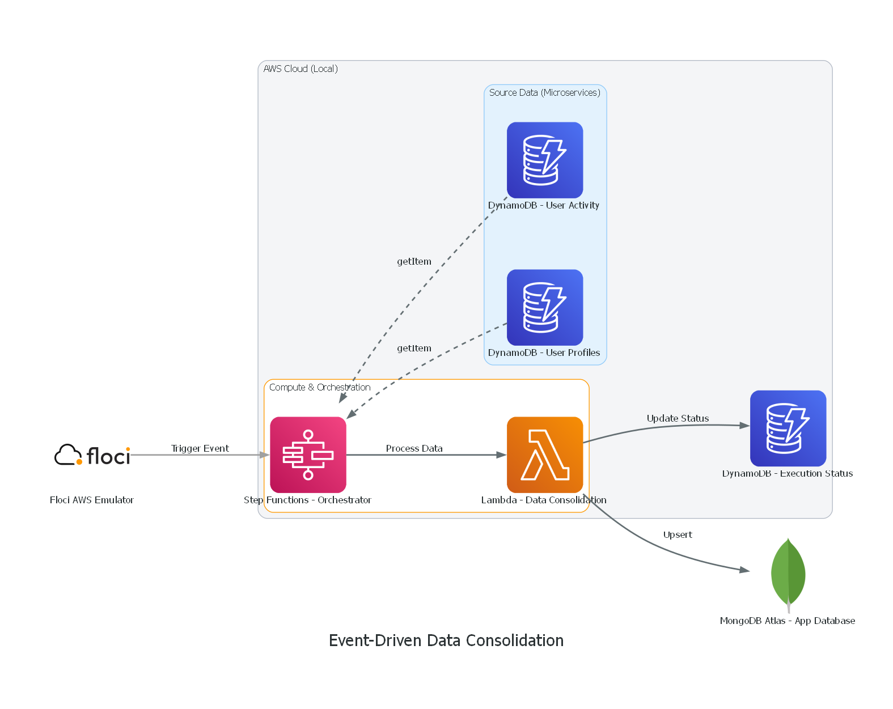

# Event-Driven Data Pipeline Architecture

An end-to-end serverless data pipeline that ingests user activity, enriches it with profile data, and stores the consolidated result in MongoDB Atlas.

## Architecture Overview

The architecture implements a Serverless Data Consolidation Pipeline using **AWS Step Functions** with Direct Service Integration, avoiding unnecessary Lambda executions.



**Flow:**
1. A trigger event (e.g., from Floci emulator or an external service) starts the **AWS Step Functions** orchestrator.
2. Step Functions performs a parallel **Direct Integration** (`getItem`) to fetch user data from two DynamoDB tables (`tb_user_profile` and `tb_user_activity`).
3. The collected data is passed to a single **AWS Lambda** (Data Consolidation).
4. The Lambda consolidates the payload, writes the result to **MongoDB Atlas**, and updates the execution status in a third DynamoDB table (`tb_execution_status`).

## Local Development Environment (Floci)

To run the pipeline locally and emulate AWS infrastructure, we use a Docker environment with **Floci** (a local cloud emulator) and a local MongoDB instance.

### Prerequisites

- Docker and Docker Compose installed
- Terraform installed

### Floci Setup & Deployment

1. **Start the local emulators:**

   ```bash
   docker-compose up -d
   ```

   _This starts the `eda-floci` container (mocking AWS DynamoDB, SQS, Lambda, Step Functions) and `eda-mongodb`._

2. **Deploy infrastructure locally:**
   Since we transitioned to the real AWS cloud, the local Terraform configuration was backed up to the `floci/` folder.

   ```bash
   cd floci
   terraform init
   terraform apply
   ```

3. **Testing locally:**
   You can run the python seed scripts or tests pointing to `http://localhost:4566`.

### Cleanup

1. **Destroy local resources:**

   ```bash
   cd floci
   terraform destroy
   ```

2. **Stop the Docker environment:**
   ```bash
   docker-compose down
   ```

### Testing

1. **Generate test data:**

   ```bash
   python scripts/generate_test_data.py
   ```

2. **Run the Lambda function:**
   ```bash
   python tests/test_lambda.py
   ```

### Deployment to AWS

1. **Upload MongoDB Credentials to SSM:**
   Create a `.env` file from `.env.example` with your `MONGO_USER` and `MONGO_PASSWORD`, then run the script to securely store them in AWS Parameter Store:
   ```bash
   python scripts/upload_ssm.py
   ```

2. **Initialize Terraform:**

   ```bash
   cd terraform
   terraform init
   ```

2. **Review the plan:**

   ```bash
   terraform plan
   ```

3. **Apply the changes:**
   ```bash
   terraform apply -auto-approve
   ```

4. **Test the Pipeline Execution:**
   Once deployed, you can trigger the Step Functions orchestrator manually to test the flow and verify the Status Table.
   
   ```bash
   # From the root directory
   aws stepfunctions start-execution \
       --state-machine-arn arn:aws:states:us-east-1:672350744151:stateMachine:DataConsolidationStateMachine \
       --input file://tests/sfn_payload.json \
       --profile portfolio-sandbox
   ```
   
   Check the `tb_execution_status` DynamoDB table afterward to see the `COMPLETED` or `FAILED` state!

### Cleanup

1. **Destroy the resources:**

   ```bash
   cd terraform
   terraform destroy
   ```

2. **Stop the Docker environment:**
   ```bash
   docker-compose down
   ```

## Code Structure

- `floci/`: Local development environment code (temporary)
- `terraform/`: Terraform infrastructure definitions
- `src/`: Source code for Lambda functions
  - `lambda_function/`: Main orchestrator Lambda
  - `lambda_activity/`: User activity processing
  - `lambda_profile/`: User profile processing
- `scripts/`: Utility scripts for testing and automation
- `tests/`: Test scripts
